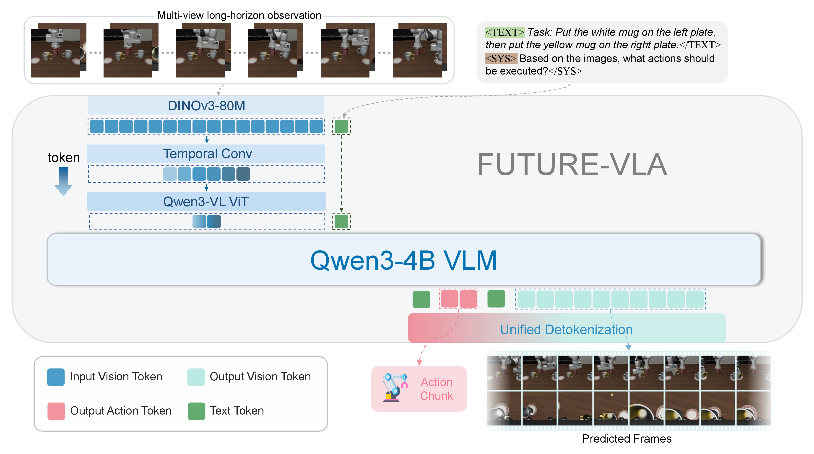
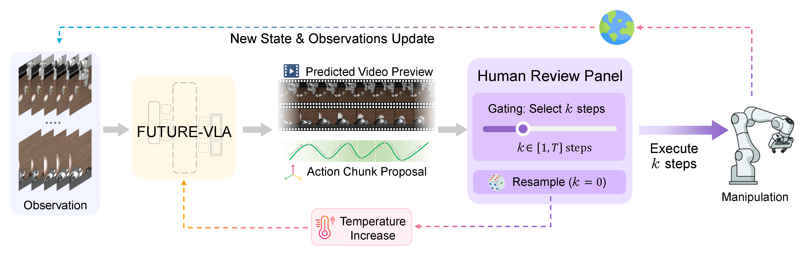

# FUTURE-VLA: Forecasting Unified Trajectories Under Real-time Execution

**FUTURE-VLA** proposes a unified architecture that reformulates **Long-horizon Control** and **Future Forecasting** as a single sequence generation task. Through adaptive temporal compression strategies and latent-space autoregression, the model can process spatiotemporal windows extended by 16× while maintaining single-frame inference latency.

---

## 🖼️ Model Architecture



---

## 🏗️ System Architecture



---

## 🚀 Key Highlights

* **Unified Sequence Generation**: Aligns action dynamics with visual look-aheads simultaneously in a single forward pass.
* **Efficient Spatiotemporal Compression**: Leverages DINOv3 and temporal convolution strategies to achieve high information density multi-view history ingestion.
* **Interpretable Predictive Guidance**: Supports human-in-the-loop interactive execution gating based on future prediction previews.

---

## 🗓️ Roadmap

We will gradually release source code and pretrained models. Stay tuned:

- [x] **Training Code Release** ⭐: Including core model architecture (based on Qwen3-4B) and spatiotemporal compression strategy implementation.
- [x] **Benchmark Suite** ⭐
  - [x] Evaluation code ⭐
  - [x] Model checkpoints ⭐

---

## 🔧 Training Pipeline

The training pipeline consists of two main stages:

1. **Training of Compact 1D Visual Tokenizer**: Train TiTok-based tokenizer for efficient visual representation
2. **Training of FUTURE-VLA**: Train the unified model with Qwen3-4B backbone

For detailed training instructions, please refer to [Training Pipeline](assets/TrainingPipeline.md).

**Note**: There may be environment conflicts in training dependencies. If you encounter any issues, please open an issue to help us resolve them.

---

## 🎯 Benchmark Suite

We release a comprehensive Benchmark Suite for model evaluation, which includes a minimal ready-to-run library containing evaluation code and pretrained model weights. We will continuously update and improve the Benchmark Suite to support more evaluation tasks and models.

### 🤖 LIBERO Evaluation

LIBERO (Lifelong Benchmark for Robot Manipulation) provides a comprehensive testbed for evaluating manipulation policies across diverse tasks and environmental variations.

For detailed evaluation instructions, please refer to [LIBERO Evaluation Guide](assets/libero.md).

### 🤖 RoboTwin Evaluation

We are currently organizing and reviewing the code and model checkpoints for RoboTwin evaluation. Stay tuned for the upcoming release!

### 🌍 Real-World Evaluation

We are currently organizing and reviewing the code and model checkpoints for real-world robot evaluation. Stay tuned for the upcoming release!

# Bibtex

Please consider citing our paper if this repository helps your research:
```
@misc{fan2026futurevlaforecastingunifiedtrajectories,
      title={FUTURE-VLA: Forecasting Unified Trajectories Under Real-time Execution}, 
      author={Jingjing Fan and Yushan Liu and Shoujie Li and Botao Ren and Siyuan Li and Xiao-Ping Zhang and Wenbo Ding and Zhidong Deng},
      year={2026},
      eprint={2602.15882},
      archivePrefix={arXiv},
      primaryClass={cs.RO},
      url={https://arxiv.org/abs/2602.15882}, 
}
```
