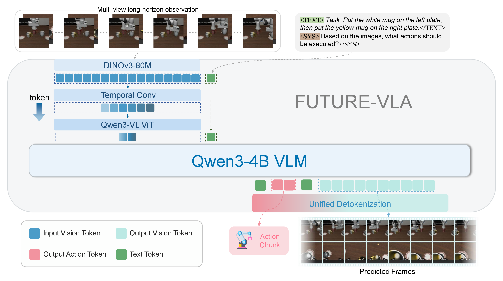
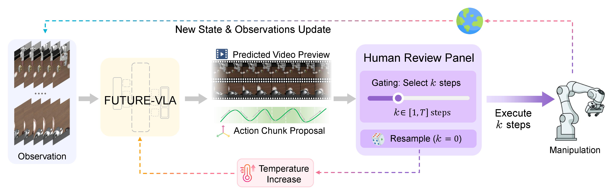

# FUTURE-VLA: Forecasting Unified Trajectories Under Real-time Execution

**FUTURE-VLA** proposes a unified architecture that reformulates **Long-horizon Control** and **Future Forecasting** as a single sequence generation task. Through adaptive temporal compression strategies and latent-space autoregression, the model can process spatiotemporal windows extended by 16× while maintaining single-frame inference latency.

---

## 🖼️ Model Architecture

---

## 🏗️ System Architecture

---

## 🚀 Key Highlights

* **Unified Sequence Generation**: Aligns action dynamics with visual look-aheads simultaneously in a single forward pass.
* **Efficient Spatiotemporal Compression**: Leverages DINOv3 and temporal convolution strategies to achieve high information density multi-view history ingestion.
* **Interpretable Predictive Guidance**: Supports human-in-the-loop interactive execution gating based on future prediction previews.

---

## 🗓️ Roadmap

We will gradually release source code and pretrained models. Stay tuned:

- [ ] **Training Code Release**: Including core model architecture (based on Qwen3-4B) and spatiotemporal compression strategy implementation.
- [ ] **Benchmark Suite**
  - [ ] Evaluation code
  - [ ] Model checkpoints

---

## 🔧 Training Pipeline

The training pipeline consists of two main stages:

1. **Training of Compact 1D Visual Tokenizer**: Train TiTok-based tokenizer for efficient visual representation
2. **Training of FUTURE-VLA**: Train the unified model with Qwen3-4B backbone

For detailed training instructions, please refer to [Training Pipeline](assets/TrainingPipeline.md).

---

